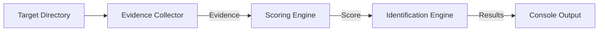

# Lynx

Lynx is a Python-based directory scanner designed to identify project languages, frameworks, libraries, runtimes, package managers, tools, and configurations.

---

## Architecture Overview

The system is organized into a modular three-stage pipeline:



### 1. Evidence Collector (`evidence_collector.py`)
Traverses the project directory tree iteratively (using `os.scandir`) to gather raw tech indicators:
*   **File Extensions**: Tallies extensions to determine language presence.
*   **File Relative Paths**: Catalogues file names and relative paths to detect framework blueprints.
*   **Dependencies**: Scans matches for target keywords inside configured configuration and package manager files using a boundary-aware algorithm.

### 2. Scoring Engine (`scoring_engine.py`)
Processes the gathered `Evidence` to rank and classify technologies:
*   **Language Scoring**: Calculates percentage-based representation for primary, secondary, and supporting languages.
*   **Technology & Dependency Scoring**: Maps filenames and keyword occurrences to their respective categories (e.g. frameworks, libraries, tools) and aggregates scores using $O(1)$ flat lookup tables.

### 3. Identification Engine (`identification_engine.py`)
Finalizes technology detection:
*   Filters technologies by checking the accumulated scores against category-specific thresholds (e.g., frameworks $\ge 10$, tools $\ge 5$).
*   Formats and displays the identified technology stack to the console.

---

## Core Execution Flow (`main.py`)

```python
def main():
    # 1. Collect evidence
    evidence = scan("~/workspace/project/")
    
    # 2. Score technology signals
    score = scoreingEngine(evidence)
    
    # 3. Identify and print tech stack
    engine = IdentificationEngine(score)
    engine.identify()
    engine.display()
```